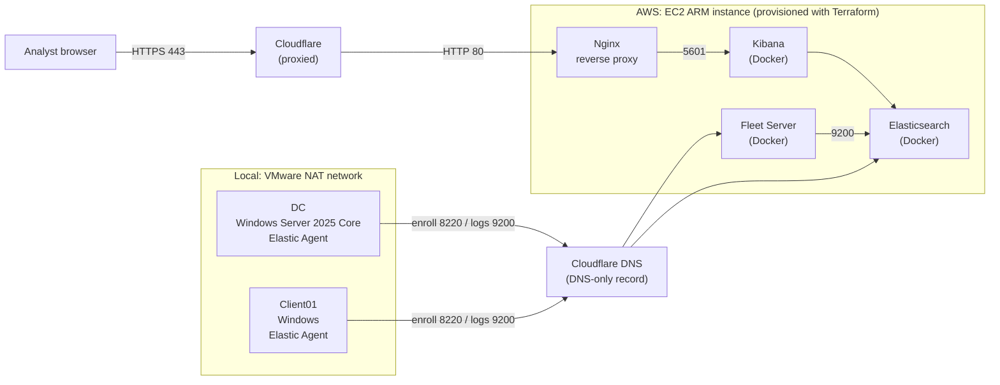

# ELK SIEM on AWS (Terraform)

Elastic Stack SIEM deployed on AWS with Terraform, with a Windows Server 2025 Core domain controller sending logs through Fleet-managed Elastic Agents. One custom detection rule (brute-force logons) was written and tested.

**Status:** Torn down after testing. Rebuild with `terraform apply`. [confirm]

**Scope:** Lab environment. Not hardened for production. Known gaps are listed below.

## Architecture



- Analyst browser > Cloudflare (443) > Nginx (80) > Kibana (5601, Docker) on an EC2 instance
- Elastic Agents on the Windows domain controller > Fleet Server (8220) > Elasticsearch (9200)
- DNS records created by Terraform

[Add: where the domain controller and Windows client run (AWS or local VMs).]

## Components

| Component | Detail |
|---|---|
| SIEM host | AWS EC2, ARM instance, 16 GB RAM, 4 vCPU (ARM chosen for cost) [instance type] |
| Stack | Elasticsearch, Kibana, Fleet Server, run with Docker on ARM via a user-data script [Elastic version] |
| Reverse proxy | Nginx, forwards port 80 to Kibana on 5601, behind Cloudflare |
| DNS | A record created with Terraform |
| Endpoint | Windows Server 2025 Datacenter Core domain controller with Elastic Agent |
| Attack simulation host | Debian instance with MITRE Caldera installed (not yet used, see Next steps) |

## Deployment

1. `terraform init` and `terraform apply` provision the EC2 instance, security groups and DNS record. [add variables needed]
2. The user-data script installs Docker and docker-compose, then starts the Elastic Stack. Output is logged to the cloud-init log.
3. Nginx is configured as a reverse proxy to Kibana (see Problems and fixes for the SELinux setting).
4. Two Kibana users were created with generated passwords. Credentials are not stored in this repo.
5. Fleet Server is reachable on port 8220 (Cloudflare record set to DNS-only, not proxied).
6. Fleet has two outputs: one for the Fleet Server (`localhost:9200`) and one for agents (`agents.<your-domain>:9200`).
7. The domain controller was set up on Windows Server 2025 Core, a Windows client was joined to the domain, and Elastic Agents were enrolled. [add: how the agent was installed]
8. The brute-force detection rule was created in Kibana (see Detection).

## Detection: brute-force logons

| Field | Value |
|---|---|
| Rule type | Threshold [confirm] |
| Data source | Windows Security event 4625 (failed logon) from Elastic Agent |
| Logic | 10 or more 4625 events per `host.name` within 5 minutes |
| ATT&CK | T1110 Brute Force |
| Rule schedule | [interval] with [look-back] |
| Test | PowerShell script, 20 failed logon attempts, one per second |
| Test started | 17:54:55 (from the event logs) |
| Alert timestamp | 17:59:04 |
| Alert delay | About 4 minutes 9 seconds |

The delay is expected: detection rules run on a schedule, and events also take time to be shipped and indexed. Shorten the interval to reduce delay, and set the look-back longer than the interval so events are not missed between runs.

Test script (lab only, run on the domain controller; set the variables first):

```powershell
$user = "[test account]"
$badPassword = "[wrong password]"

1..20 | ForEach-Object {
    $cred = New-Object System.Management.Automation.PSCredential(
        $user,
        (ConvertTo-SecureString $badPassword -AsPlainText -Force)
    )

    try {
        Start-Process powershell.exe -Credential $cred -ArgumentList '-NoProfile -Command "exit"' -ErrorAction Stop
    }
    catch {
        Write-Host "Attempt $_ failed as expected."
    }

    Start-Sleep -Seconds 1
}
```

Limitations:
- The rule groups by `host.name` only. It measures failed logon volume per machine, not per account or source.
- The test uses a local logon, so there is no source IP. A real network brute force would show a source IP and a different logon type.
- Tuning ideas: group by target account and source IP for network logons, and exclude service accounts with stale credentials.

Rule export: [`rules/bruteforce_4625.ndjson`](rules/bruteforce_4625.ndjson) [add]

## Problems and fixes

| Symptom | Cause | Fix |
|---|---|---|
| Bad Gateway from Nginx | SELinux blocked Nginx from making network connections | `setsebool -P httpd_can_network_connect 1` |
| docker-compose missing | Not included in the Amazon AMI | Installed manually in the user-data script |
| Unhealthy Fleet agents | Only one output configured | Two outputs: Fleet Server to `localhost:9200`, agents to `agents.<your-domain>:9200` |
| Atomic Red Team failed with exit code 2 | [cause, if found] | Used the PowerShell script above to generate the events |
| Alert appeared minutes after the test | Rule schedule and ingestion delay | Measured and documented above |

## Security decisions and known gaps

| Exposure | State in this lab | Production approach |
|---|---|---|
| Kibana | Cloudflare (443) > Nginx (80), only allowed traffic from cloudflare IPs | Same |
| Fleet Server (8220) | Cloudflare DNS-only record, restricted to my IP | Restrict by security group, TLS |
| Elasticsearch (9200) | Restricted to my IP | Private networking or VPN, TLS, no public exposure |
| Credentials | Generated with openssl, not committed | Secrets manager |
| SSH key | Exported for troubleshooting the user-data script | Remove or use a managed access method after setup |

## Next steps

- Run MITRE Caldera from the Debian instance against the domain controller and record which techniques are detected and which are missed.
- Add more rules, including Active Directory techniques, mapped to ATT&CK.
- Manage the Windows side and the rules as code.

## Cost and teardown

- The SIEM instance cost about $0.15 per hour, which is roughly $110 to $113 per month if left running. [add actual AWS billed total for the lab period]
- Teardown: `terraform destroy`, then revoke the Cloudflare API token, then delete the local VMs. Check the AWS console for leftover volumes, snapshots and Elastic IPs.

## Notes

The brute-force script was drafted by AI and modified to increase the logon counts from 5 to 20 